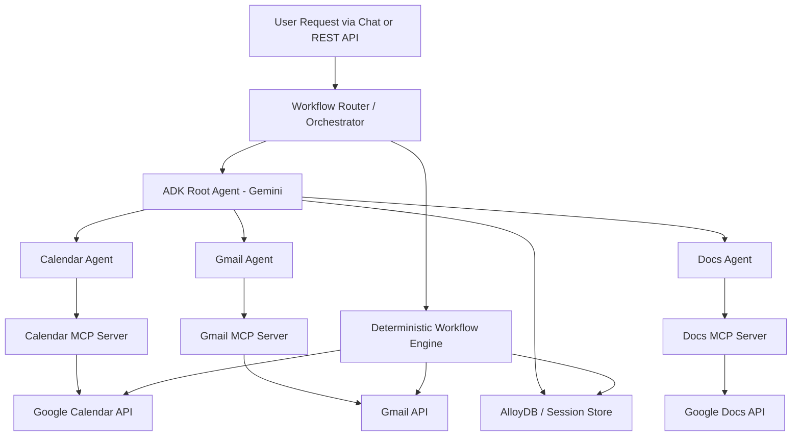

# 🚀 Workspace Workflow Orchestrator

A **multi-agent AI productivity system** that helps users manage emails, meetings, and documents through a single chat interface.

Built using **Google ADK + Gemini + MCP + AlloyDB**, the system coordinates specialized agents to execute **real productivity workflows across Gmail, Google Calendar, and Google Docs**.

---

## 🎥 Demo Video

```text
https://drive.google.com/file/d/1KxYjessbpg73HhGrbdxkIyKZ8BDuu9T2/view?usp=sharing
```
---

## 🚀 Live Demo

```text
https://workspace-workflow-orchestrator-680512272938.us-east4.run.app
```

---

## 📌 Overview

Modern workplace productivity is fragmented across multiple tools. Even a simple action like organizing a meeting can require switching between email, calendar, and documents.

**Workspace Workflow Orchestrator** solves this by introducing a central orchestration layer that:
- understands natural language intent,
- routes tasks to specialized agents,
- executes multi-step workflows across tools,
- and returns a unified response with workflow transparency.

---

## 🎯 Problem Statement

Users lose time and context when coordinating work across disconnected applications.

Typical pain points include:
- scheduling meetings while checking availability,
- creating agendas or notes in separate tools,
- drafting follow-up emails manually,
- managing multiple productivity actions from a single request.

This project addresses that gap with an **AI-driven multi-agent execution system** rather than a chat-only assistant.

---

## 🤖 What It Can Do

- 📅 Schedule meetings and avoid conflicts  
- 📧 Read and summarize emails  
- 📝 Generate documents such as agendas and notes  
- 🔁 Execute multi-step workflows across tools  
- 🧠 Maintain session context and workflow history  
- 🔍 Show workflow execution steps for transparency  

### Example Prompt
> “Schedule a kickoff meeting, create an agenda document, and send a notification email.”

---

## 🚀 Why This Project Stands Out

This project directly aligns with the hackathon goal by demonstrating:

- **True multi-agent coordination**  
  A central orchestrator delegates work to specialized agents instead of relying on a single monolithic prompt.

- **Tool integration via MCP**  
  Gmail, Calendar, and Docs are connected through MCP servers for structured tool execution.

- **Persistent workflow memory**  
  Session history, workflow logs, and interactions are stored for continuity and traceability.

- **Multi-step action execution**  
  A single prompt can trigger several coordinated actions across services.

- **Deterministic workflows for reliability**  
  Critical actions such as schedule, cancel, and reschedule are handled with controlled logic to reduce ambiguity.

- **Production-style deployment**  
  The solution is deployable on Google Cloud Run through an HTTP-based interface.

---

## 🚀 Unique Selling Points (USP)

- ⚡ Multi-agent execution, not just conversational response generation  
- 🔁 End-to-end workflow automation across real productivity tools  
- 🧠 Hybrid architecture combining deterministic logic with LLM-based orchestration  
- 📊 Persistent memory using AlloyDB for sessions and workflow logs  
- ☁️ Cloud Run deployment for real-world, scalable serving  

---

## 🤔 Why Not Just a Generic Chat Assistant?

Unlike a generic chatbot, this system:
- performs real actions across productivity platforms,
- coordinates multiple specialized agents,
- maintains workflow context and execution history,
- and integrates directly with Google Workspace APIs.

The result is a system that **does work**, not one that only **talks about work**.

---

## ⚙️ How It Works

1. User sends a request through the chat interface or REST API  
2. The system first checks deterministic workflows for high-reliability actions  
3. If no deterministic path matches, the request is routed to the orchestrator agent powered by Gemini  
4. The orchestrator delegates tasks to:
   - `calendar_agent`
   - `docs_agent`
   - `gmail_agent`
5. Results from each agent are combined into a single response  
6. Workflow steps are returned for transparency and demo clarity  

---

## 🏗️ Architecture Diagram



---

## ⚡ Quick Start

### 1. Clone the Repository
```bash
git clone https://github.com/SwethaTalapalli/workspace-workflow-orchestrator.git
cd workspace-workflow-orchestrator
```

### 2. Set Up the Environment
```bash
python3 -m venv .venv
source .venv/bin/activate
pip install -r requirements.txt
```

### 3. Configure Environment Variables
Create a `.env` file:

```env
GOOGLE_API_KEY=your_gemini_api_key
GOOGLE_CLOUD_PROJECT=your_project_id
GOOGLE_CLOUD_REGION=us-central1
DB_MODE=sqlite
GOOGLE_OAUTH_CREDENTIALS_FILE=app/credentials.json
```

### 4. Run the App
```bash
uvicorn app.main:app --reload
```

Open:
```text
http://localhost:8080
```

---

## ☁️ Deployment on Cloud Run

```bash
gcloud run deploy workspace-workflow-orchestrator \
  --source . \
  --region us-east1 \
  --allow-unauthenticated
```

---

## ⚡ Example Workflows

All examples below are suitable for demoing the system through the `/api/chat` endpoint.

### 1. Morning Briefing
```text
Give me my morning briefing
```

Combines:
- upcoming calendar events,
- unread email summaries.

### 2. Schedule Meeting
```text
Schedule a Design review meeting tomorrow at 3 PM with alice@example.com
```

Creates a calendar event with attendees.

### 3. Schedule Meeting + Send Email
```text
Schedule a Design review meeting tomorrow at 3 PM with alice@example.com and send a notification email
```

Executes:
- Calendar → create event  
- Gmail → send notification email  

### 4. Schedule + Create Agenda + Draft Email
```text
Schedule a Project kickoff meeting tomorrow at 10 AM with bob@example.com and create an agenda document and draft email
```

Executes:
- Calendar → create event  
- Docs → create agenda  
- Gmail → draft email  

### 5. Create Document
```text
Create a document called Sprint Notes with content: agenda, blockers, and next steps
```

Creates a Google Doc.

### 6. Check Unread Emails
```text
Check my unread emails
```

Returns:
- top unread emails,
- clean formatted summaries.

### 7. View Today’s Schedule
```text
What meetings do I have today?
```

Fetches today's calendar events.

### 8. Cancel Meeting + Notify
```text
Cancel meeting Project kickoff meeting and notify attendees
```

Executes:
- cancel calendar event,
- notify attendees by email.

### 9. Reschedule Meeting + Notify
```text
Reschedule meeting Project kickoff meeting to tomorrow at 4 PM and notify attendees
```

Executes:
- update calendar event,
- notify attendees.

### 10. Full Workflow
```text
Schedule a Sprint planning meeting tomorrow at 11 AM with team@example.com and create an agenda document and send email
```

Executes:
- Calendar → create event  
- Docs → create agenda  
- Gmail → send email  

---

## 🔍 Workflow Transparency

The system not only executes tasks but also shows how they were completed.

### Example Output
```text
✔ calendar_agent → create_event
✔ docs_agent → create_document
✔ gmail_agent → send_email
```

This makes multi-agent coordination visible and easy to explain during demos.

---

## 📂 Project Structure

```text
workspace-workflow-orchestrator/
├── README.md
├── PROMPT.md
├── requirements.txt
├── .env.example
├── Dockerfile
├── cloudbuild.yaml
├── app/
│   ├── main.py
│   ├── config.py
│   ├── agents/
│   │   ├── orchestrator.py
│   │   ├── calendar_agent.py
│   │   ├── docs_agent.py
│   │   └── gmail_agent.py
│   ├── mcp/
│   │   ├── calendar_server.py
│   │   ├── docs_server.py
│   │   └── gmail_server.py
│   ├── db/
│   │   ├── database.py
│   │   └── models.py
│   ├── schemas/
│   │   ├── chat.py
│   │   └── workflow.py
│   ├── services/
│   │   └── google_auth.py
│   └── api/routes/
│       └── chat.py
└── tests/
```

---

## 🧰 Tech Stack

| Component | Technology |
|---|---|
| Agent Framework | Google ADK |
| Model | Gemini 2.5 Flash |
| Tool Protocol | MCP (Model Context Protocol) |
| Database | Google AlloyDB |
| API Layer | FastAPI + Uvicorn |
| Deployment | Google Cloud Run |
| Productivity Integrations | Gmail, Google Calendar, Google Docs |
| Authentication | Google OAuth 2.0 |

---

## 🔐 Security

- Sensitive files such as `.env`, `token.json`, `tokens.json`, and `credentials.json` should never be committed.
- Use `.gitignore` to exclude local secrets and generated auth artifacts.
- Revoke and regenerate tokens immediately if any secret file was previously pushed.
- For production deployments, prefer **GCP Secret Manager** over local secret files.

Suggested `.gitignore` entries:

```gitignore
.env
*.env
token.json
tokens.json
app/token.json
app/tokens.json
app/credentials.json
__pycache__/
*.pyc
.venv/
```

---

## 🏆 Hackathon Value

This project demonstrates:
- multi-agent architecture,
- real tool execution,
- persistent workflow memory,
- production-ready deployment,
- and strong real-world applicability for workplace productivity automation.

---

## 📈 Future Improvements

- Slack or Microsoft Teams integration  
- smarter preference learning from workflow history  
- richer retrieval over documents and email context  
- better workflow analytics and execution dashboards  
- voice-based interaction layer for hands-free productivity  

---

## 🙌 Acknowledgements

- Google ADK  
- Gemini  
- MCP  
- Google Cloud Run  
- AlloyDB  
- Google Workspace APIs  

---